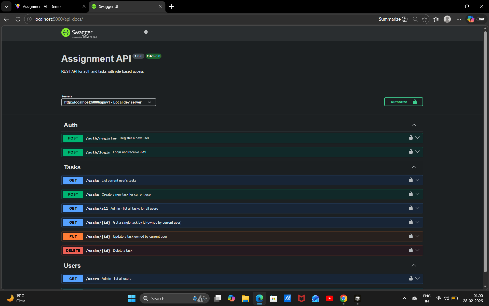
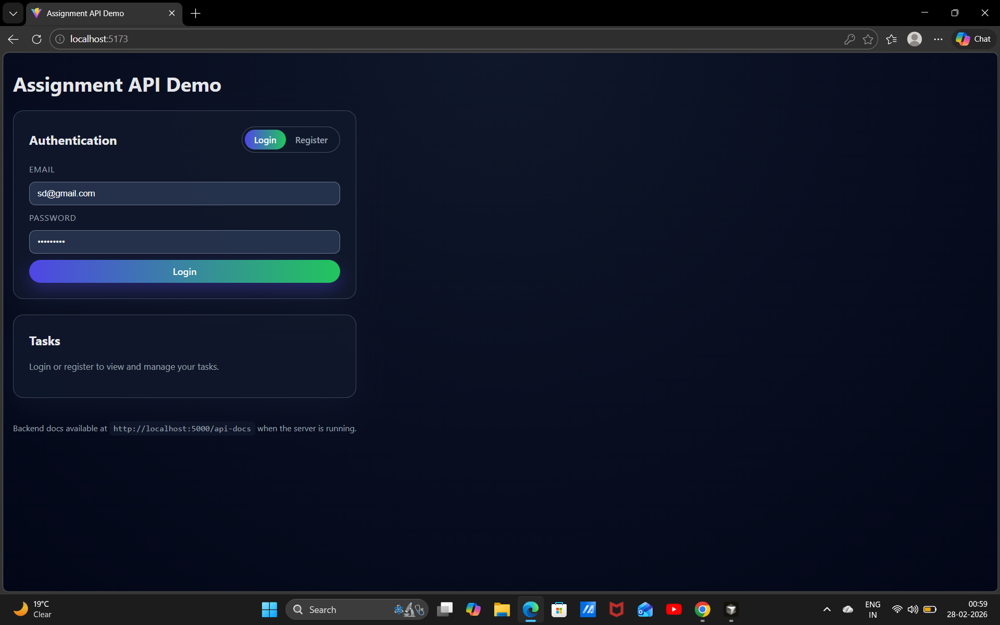

# Assignment: Scalable REST API with Auth & Role-Based Access

## Project overview

This repository contains a **Node.js/Express + MongoDB backend** with JWT authentication and role-based access (user/admin), and a **React (Vite) frontend** used to exercise and demo the APIs.

### Tech stack
- **Backend**: Node.js, Express 5, MongoDB (Mongoose), JWT, bcrypt, express-validator, helmet, morgan, Swagger UI
- **Frontend**: React + Vite
- **Database**: MongoDB

Backend base URL: `http://localhost:5000/api/v1`  
Frontend dev URL: `http://localhost:5173`  
API docs (Swagger): `http://localhost:5000/api-docs`

---

## Folder structure

- `backend/`
  - `server.js` – entrypoint, loads app and connects to Mongo
  - `src/app.js` – Express app setup (middleware, routes, Swagger)
  - `src/config/db.js` – MongoDB connection helper
  - `src/config/swagger.js` – Swagger/OpenAPI config
  - `src/models/User.js` – user schema with bcrypt hashing and roles (`user`, `admin`)
  - `src/models/Task.js` – task schema (title, description, status, owner)
  - `src/controllers/*.js` – auth, task, and user controllers
  - `src/routes/*.js` – versioned API routes (`/auth`, `/tasks`, `/users`)
  - `src/middleware/auth.js` – JWT auth + role-based access
  - `src/middleware/errorHandler.js` – centralized error handler
- `frontend/vite-project/`
  - `src/App.jsx` – single-page UI for login, registration, and task CRUD
  - `src/App.css` – basic, modern UI styling

---

## Getting started

### 1. Prerequisites

- Node.js (v18+ recommended)
- npm
- MongoDB running locally (or a MongoDB connection string)

---

### 2. Backend setup

From the project root:

```bash
cd backend
npm install
```

Create a `.env` file in `backend/`:

```env
PORT=5000
MONGO_URI=mongodb://localhost:27017
MONGO_DB_NAME=assignment_db
JWT_SECRET=change_this_secret
JWT_EXPIRES_IN=1d
```

Start the backend in dev mode:

```bash
cd backend
npm run dev
```

You should see logs similar to:

- `Database connected`
- `Server running on port 5000`

Verify:

- `GET http://localhost:5000/` → `{ "message": "API is running" }`
- Swagger UI at `http://localhost:5000/api-docs`

---

### 3. Frontend setup

From the project root:

```bash
cd frontend/vite-project
npm install
npm run dev
```

Open the URL Vite prints (typically `http://localhost:5173`) in your browser.

If your backend runs on a different port, update the base URL in `frontend/vite-project/src/App.jsx`:

```js
const API_BASE_URL = 'http://localhost:5000/api/v1';
```

---

## API overview

All routes are versioned under `/api/v1`.

### Auth

- **POST** `/auth/register`  
  - Registers a new user (default role: `user`, but `role` field can be `user` or `admin`).  
  - Request (JSON):

    ```json
    {
      "name": "Alice",
      "email": "alice@example.com",
      "password": "password123",
      "role": "user"
    }
    ```

  - Response: `201 Created` with user info and JWT token.

- **POST** `/auth/login`  
  - Logs in an existing user.  
  - Request (JSON):

    ```json
    {
      "email": "alice@example.com",
      "password": "password123"
    }
    ```

  - Response: `200 OK` with user info and JWT token.

JWT is passed via the `Authorization: Bearer <token>` header.

### Tasks (CRUD)

All task routes require a valid JWT.

- **GET** `/tasks`  
  - Returns **current user’s** tasks.

- **POST** `/tasks`  
  - Creates a new task for the current user.
  - Body:

    ```json
    {
      "title": "My task",
      "description": "Optional description"
    }
    ```

- **GET** `/tasks/{id}`  
  - Get a single task owned by the current user.

- **PUT** `/tasks/{id}`  
  - Update a task owned by the current user (title/description/status).

- **DELETE** `/tasks/{id}`  
  - Delete a task.
  - Normal users: can delete **only their own** tasks.  
  - Admins: can delete **any** task.

### Admin-only routes

Require JWT **and** role `admin`.

- **GET** `/tasks/all`  
  - List all tasks for all users.

- **GET** `/users`  
  - List all users (without passwords).

- **PATCH** `/users/{id}/role`  
  - Update a user’s role (`user` or `admin`).

All endpoints are documented and testable via Swagger at `http://localhost:5000/api-docs`.

---

## Frontend behavior

The React UI provides:

- **Authentication card**
  - Switch between **Login** and **Register**.
  - Registration includes a **Role** dropdown (`user`/`admin`) to simplify testing role-based access.
  - Shows API errors inline when authentication fails.

- **Tasks card**
  - For authenticated users:
    - Create tasks (title + optional description).
    - See a list of tasks with status badges.
    - Delete tasks (DELETE `/tasks/{id}`).
  - For admins only:
    - Toggle between **My tasks** and **All users** (uses `/tasks` vs `/tasks/all`).
    - Can delete any user’s task from the **All users** view.

---

## Screenshots

Place your images in a `screenshots/` folder in the project root, alongside `backend/`, `frontend/`, and `README.md`, then reference them like this:





---

- Swagger UI at `http://localhost:5000/api-docs` showing:
  - Auth, Tasks, and Users endpoints.
- React app:
  - Registration or login screen.
  - Dashboard with tasks after login as a normal user.
  - Admin logged in, with **All users** task view visible.

---

## Security practices

- **Password hashing** with `bcryptjs` and a pre-save hook on the `User` model.
- **JWT-based auth** with `Authorization: Bearer <token>` and verification middleware.
- **Role-based access control** using a reusable `authorize(...roles)` middleware.
- **Input validation** using `express-validator` on all auth and write endpoints.
- **HTTP headers hardening** via `helmet`.
- **CORS** enabled for the frontend origin.
- **Centralized error handling** via `errorHandler` middleware with consistent JSON responses.

---

## Scalability & deployment notes

This codebase is intentionally simple but is structured for growth:

- **Modular architecture**  
  - Clear separation of concerns (`models`, `controllers`, `routes`, `middleware`, `config`) makes it easy to add new modules (e.g., `projects`, `comments`) without touching existing code.

- **Horizontal scaling & load balancing**  
  - The backend is stateless (sessions are JWT-based), so it can run behind a load balancer (NGINX, AWS ELB, etc.) with multiple replicas.
  - For production, you can containerize the backend with Docker and run multiple containers behind a reverse proxy.

- **Database scaling**  
  - MongoDB supports replica sets for high availability and sharding for large datasets.
  - Connection options in `db.js` can be expanded to use connection pools and timeouts appropriate for production.

- **Caching (optional)**  
  - Frequently-read data (e.g., task lists for a dashboard) can be cached in **Redis** to reduce DB load.  
  - For example, cache `/tasks/all` for a short TTL for admin dashboards.

- **Logging & monitoring**  
  - `morgan` provides basic request logging; this can be extended with a structured logger (e.g., Winston, Pino) and shipped to a centralized log store (ELK, Datadog).
  - Health checks (`/healthz`) and metrics (Prometheus, OpenTelemetry) can be added for observability.

- **Deployment**  
  - Typical production setup:
    - Dockerize the backend (`Dockerfile`) and frontend (static build served by NGINX).
    - Use environment variables for secrets and DB URLs.
    - Run in a container orchestrator (Docker Compose, Kubernetes, ECS, etc.) with rolling updates.

These notes can be expanded easily into a fuller design doc if needed, but they already cover the main scalability and deployment considerations expected for this assignment.

